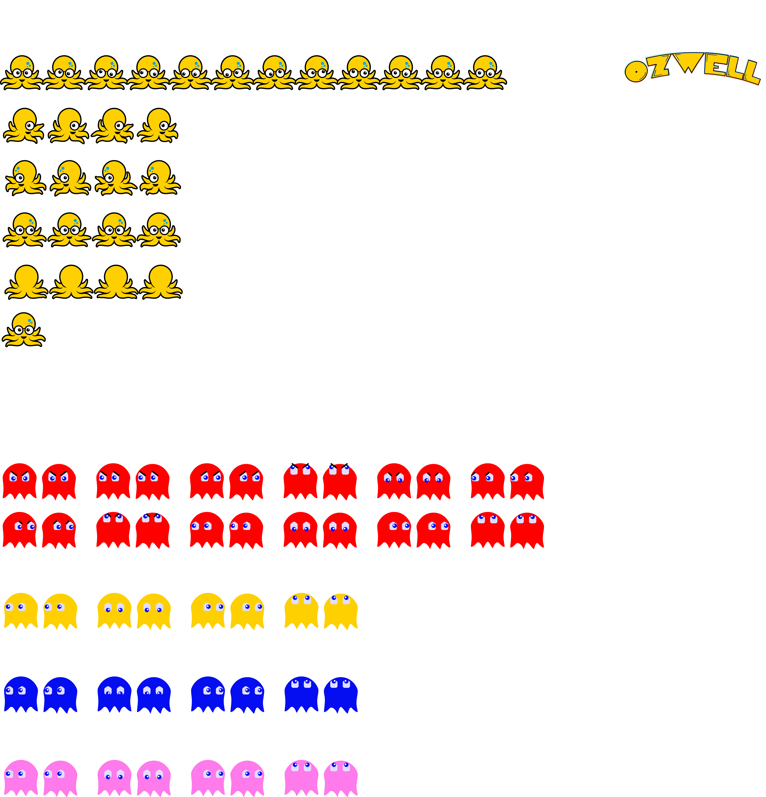

# ozwell ai game - fork from pacman-js

HUGE credit to https://github.com/bward2/pacman-js for the base game. This repo exists as a fun side project replacing pacman with Ozwell.

[](https://travis-ci.com/bward2/pacman-js)
[](https://coveralls.io/github/bward2/pacman-js?branch=master)
[](https://github.com/airbnb/javascript)

Pacman clone made with Javascript, HTML, and CSS.

### _**[Play it!](https://game.ozwell.ai)**_

🍒🍓🍊🍎🍈👾🔔🔑

## Development Instructions

This project makes use of _**[NodeJS](https://nodejs.org/en/)**_. Download it, then clone this repo and run the following commands:

1. `npm i` (Installs necessary packages for development)
1. `npm run watch` (Watches changes to JS and SCSS files for continuous compilation)
1. `npm run serve` (Hosts the files locally)

The game can now be accessed at _**http://127.0.0.1:8080/index**_

This project also utilizes _**[Husky](https://github.com/typicode/husky)**_ to enforce best coding practices. The current thresholds are 0 linting errors upon commits (following Airbnb's standard), and 100% unit test code coverage upon pushes.

Feel free to submit PRs and/or report any issues you find! 😃

### Maze Generation

The maze is generated from a JSON file located at `app/maze.json`. This file contains a `mazeArray` property—an array of strings where each string represents a row in the maze.

When running gulp, this JSON file is processed to generate SVG assets for rendering the maze as well as mark the locations of the pac dots, power pellets, and walls.

Each character maps to a specific tile:
- `X`: Primary wall tile.
- `-`: Alternate (white) wall tile for ghost door.
- `o`: Pac Dot.
- `O`: Power Pellet.
- ` `: Empty area.
- A space (` `): Empty area.

**Base Maze**

```
{
  "mazeArray": [
    "XXXXXXXXXXXXXXXXXXXXXXXXXXXX",
    "XooooooooooooXXooooooooooooX",
    "XoXXXXoXXXXXoXXoXXXXXoXXXXoX",
    "XOXXXXoXXXXXoXXoXXXXXoXXXXOX",
    "XoXXXXoXXXXXoXXoXXXXXoXXXXoX",
    "XooooooooooooooooooooooooooX",
    "XoXXXXoXXoXXXXXXXXoXXoXXXXoX",
    "XoXXXXoXXoXXXXXXXXoXXoXXXXoX",
    "XooooooXXooooXXooooXXooooooX",
    "XXXXXXoXXXXX XX XXXXXoXXXXXX",
    "XXXXXXoXXXXX XX XXXXXoXXXXXX",
    "XXXXXXoXX          XXoXXXXXX",
    "XXXXXXoXX XXX--XXX XXoXXXXXX",
    "XXXXXXoXX X      X XXoXXXXXX",
    "      o   X      X   o      ",
    "XXXXXXoXX X      X XXoXXXXXX",
    "XXXXXXoXX XXXXXXXX XXoXXXXXX",
    "XXXXXXoXX          XXoXXXXXX",
    "XXXXXXoXX XXXXXXXX XXoXXXXXX",
    "XXXXXXoXX XXXXXXXX XXoXXXXXX",
    "XooooooooooooXXooooooooooooX",
    "XoXXXXoXXXXXoXXoXXXXXoXXXXoX",
    "XoXXXXoXXXXXoXXoXXXXXoXXXXoX",
    "XOooXXooooooo  oooooooXXooOX",
    "XXXoXXoXXoXXXXXXXXoXXoXXoXXX",
    "XXXoXXoXXoXXXXXXXXoXXoXXoXXX",
    "XooooooXXooooXXooooXXooooooX",
    "XoXXXXXXXXXXoXXoXXXXXXXXXXoX",
    "XoXXXXXXXXXXoXXoXXXXXXXXXXoX",
    "XooooooooooooooooooooooooooX",
    "XXXXXXXXXXXXXXXXXXXXXXXXXXXX"
  ]
}
```

## Sprites

